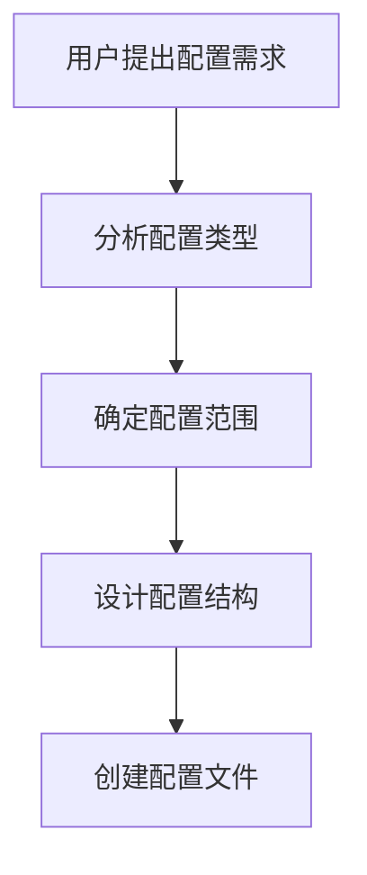

# 配置生成规则

## 规则概述

本文件定义了项目中所有 Claude 配置的生成、管理和维护规则。

## 🏗️ 配置结构规范

### 目录结构

```
.claude/
├── CLAUDE.md                    # 主配置文件（索引）
├── settings.local.json          # Claude 环境配置
├── config/                      # 配置文件目录
│   ├── config-generation-rules.md  # 本文件
│   └── {config-name}.md         # 具体配置文件
├── study-note/                  # 学习笔记输出目录
│   └── *.md                     # 生成的学习笔记
└── *.md                         # 其他配置文件
```

### 配置文件命名规则

- **主配置**: `CLAUDE.md` （固定名称）
- **环境配置**: `settings.local.json` （Claude标准）
- **业务配置**: `{功能名称}-config.md`
- **规则配置**: `{功能名称}-rules.md`
- **工具配置**: `{工具名称}-tool-config.md`

## 📝 配置文件编写规范

### 1. 文件头部格式

```markdown
# {配置名称}

## 基本信息

- **配置名称**: {完整的中英文名称}
- **版本**: {语义化版本号，如 1.0.0}
- **创建时间**: {YYYY-MM-DD}
- **适用范围**: {描述配置的适用场景}
- **维护状态**: {active/maintenance/deprecated}
```

### 2. 配置内容结构

```markdown
## 配置规则

### 子模块1

- 具体配置项
- 参数说明
- 使用示例

### 子模块2

[重复上述结构]

## 示例与说明

- 具体使用示例
- 预期输出结果
- 常见问题解答

## 相关配置文件

- [相关配置1](./relative-link.md)
- [相关配置2](./another-config.md)

---

_配置文件版本: {版本号}_
```

### 3. YAML 配置块

当配置项较多或需要结构化表示时，使用 YAML 格式：

```yaml
配置分类:
  配置项1: 值
  配置项2:
    子项1: 值
    子项2: 值
  配置项3:
    - 列表项1
    - 列表项2
```

## 🔧 新配置创建流程

### 步骤1：需求分析



### 步骤2：文件创建

1. **确定文件名**：遵循命名规范
2. **创建文件**：在 `.claude/config/` 目录下
3. **编写内容**：按照模板结构
4. **验证格式**：确保 Markdown 语法正确

### 步骤3：更新索引

1. 在 `CLAUDE.md` 中添加配置引用
2. 更新配置文件清单
3. 确保链接正确

### 步骤4：测试验证

1. 验证配置可被正确读取
2. 测试配置功能
3. 检查文档链接有效性

## 📋 配置清单模板

在 `CLAUDE.md` 中维护以下格式的配置清单：

```markdown
## 📚 配置文件索引

### 核心配置

- **📄 主配置**: 本文件 - 项目整体配置索引
- **⚙️ 环境配置**: [settings.local.json](./settings.local.json) - Claude 环境设置

### 功能配置

- **📝 学习笔记**: [学习笔记配置](./config/study-note-config.md) - 学习笔记生成规则
- **🔧 [配置名称]**: [配置文件](./config/{filename}.md) - 配置描述

### 工具配置

- **🛠️ [工具名称]**: [工具配置](./config/{tool-config}.md) - 工具使用规则

### 输出目录

- **📂 学习笔记**: `study-note/` - 生成的学习笔记存储目录
```

## 🔄 配置维护规则

### 版本管理

- **主版本**: 重大结构变更 (1.0.0 → 2.0.0)
- **次版本**: 功能添加或修改 (1.0.0 → 1.1.0)
- **修订版**: 错误修复或小调整 (1.0.0 → 1.0.1)

### 更新流程

1. **评估影响**：确定变更范围
2. **更新文件**：按照版本号规则
3. **更新索引**：同步更新 CLAUDE.md
4. **提交记录**：清晰的 commit message
5. **推送更新**：同步到远程仓库

### 兼容性规则

- **向后兼容**：新版本应支持旧版本配置
- **废弃通知**：废弃配置需提前通知
- **迁移指南**：重大变更需提供迁移方案

## 📊 配置文件模板

### 基础功能配置模板

```markdown
# {功能名称}配置

## 基本信息

- **配置名称**: {中英文名称}
- **版本**: 1.0.0
- **创建时间**: {YYYY-MM-DD}
- **适用范围**: {适用场景}

## 配置规则

### 存储配置

[具体的存储规则]

### 文件规则

[文件命名和格式规则]

### 执行流程

[自动执行流程说明]

## 示例与说明

[使用示例和说明]

---

_配置文件版本: 1.0.0_
```

### 工具配置模板

```markdown
# {工具名称}配置

## 基本信息

- **工具名称**: {工具中英文名称}
- **版本**: {工具版本}
- **配置版本**: 1.0.0
- **创建时间**: {YYYY-MM-DD}

## 使用配置

### 基础设置

[基础配置项]

### 高级设置

[高级配置项]

## 使用示例

[具体使用示例]

## 故障排除

[常见问题和解决方案]

---

_配置文件版本: 1.0.0_
```

## ⚠️ 注意事项

### 安全规则

- 敏感信息不要直接写在配置文件中
- 使用环境变量存储密钥和令牌
- 定期检查配置文件权限

### 性能规则

- 配置文件大小控制在合理范围内
- 避免过度复杂的嵌套结构
- 使用相对路径引用文件

### 维护规则

- 定期清理废弃的配置文件
- 保持配置文件的一致性
- 及时更新过时的配置项

---

_规则文件版本: 1.0.0_
_最后更新时间: 2025-11-26_
